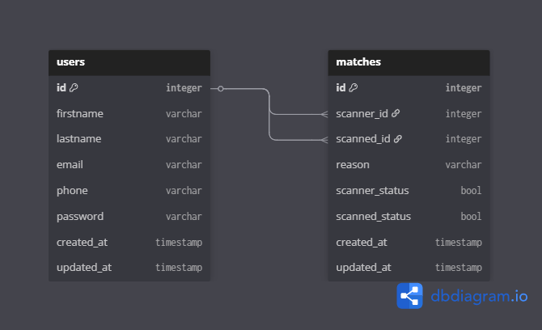

# Pitch2Match

Pitch2Match is a full-stack web application designed to facilitate networking and connections through QR code scanning. Users can create profiles, generate unique QR codes, scan others' codes to initiate matches, and manage their connections.

## Architecture Overview

The project is built using a modern decoupled architecture:

*   **Frontend**: Next.js (React) application providing a responsive and interactive user interface.
*   **Backend**: Laravel API serving as the core logic handler, managing authentication, data persistence, and business rules.
*   **Database**: MySQL database for storing users, matches, and notifications.

---

## 📂 Backend

The backend is a robust REST API built with **Laravel 12**.

### Tech Stack
*   **Framework**: Laravel 12
*   **Language**: PHP 8.2+
*   **Authentication**: Laravel Sanctum (Token-based)
*   **Documentation**: Scramble (Auto-generated API docs)

### Key Components

#### Controllers
*   **`AuthController`**: Handles user registration, login, logout, and fetching current user details. Also provides a public endpoint for fetching user profiles by ID.
*   **`MatchController`**: Manages the matching process. Handles scanning actions, listing matches, and retrieving match details.
*   **`NotificationController`**: Manages user notifications, including listing and marking them as read.

#### Services
*   **`MatchService`**: Encapsulates the business logic for creating matches. It handles the "auto-accept" logic where matches are immediately confirmed upon scanning, and prevents duplicate matches.
*   **`NotificationService`**: Handles the creation and retrieval of notifications, ensuring users are alerted when they are scanned or matched.

### API Endpoints

| Method | Endpoint | Description |
| :--- | :--- | :--- |
| **Auth** | | |
| `POST` | `/api/register` | Register a new user |
| `POST` | `/api/login` | Login and receive API token |
| `POST` | `/api/logout` | Logout (invalidate token) |
| `GET` | `/api/user` | Get authenticated user details |
| `GET` | `/api/users/{id}` | Get public user profile (No Auth required) |
| **Matches** | | |
| `POST` | `/api/matches/scan` | Create a match (Scan QR) |
| `GET` | `/api/matches` | List all matches (scans and scanned_by) |
| `GET` | `/api/matches/{id}` | Get details of a specific match |
| **Notifications** | | |
| `GET` | `/api/notifications` | List user notifications |
| `POST` | `/api/notifications/{id}/read` | Mark notification as read |

---

## 💻 Frontend

The frontend is a dynamic single-page application (SPA) built with **Next.js 16**.

### Tech Stack
*   **Framework**: Next.js 16 (App Router)
*   **Language**: TypeScript
*   **Styling**: Tailwind CSS 4
*   **State Management**: Zustand
*   **HTTP Client**: Axios
*   **QR Tools**: `qrcode` (Generation), `jsqr` (Scanning), `react-webcam`

### Key Features

*   **Authentication**: Secure login and registration flows with token management via Zustand.
*   **Dashboard**: A central hub for user activity, featuring a sticky navigation bar and mobile-friendly bottom nav.
*   **My Info**: Displays user details and a dynamically generated QR code. The QR code encodes a public profile URL (e.g., `/profile/123`).
*   **Public Profile**: A publicly accessible page (`/profile/[id]`) that allows unauthenticated users to view basic info and initiates a match flow.
    *   *Smart Redirects*: If a user isn't logged in, they are redirected to login and then back to the profile to complete the match.
*   **QR Scanner**: Integrated camera scanner that detects Pitch2Match QR codes and redirects to the corresponding profile.
*   **Notifications**: Real-time-like notification system alerting users of new matches.

---

## 🗄️ Database Schema

The database is designed to efficiently handle user relationships and notifications.



### Tables

#### `users`
Stores user account information.
*   `id`: Primary Key
*   `firstname`, `lastname`: User's name
*   `email`: Unique identifier for login
*   `phone`: Contact number
*   `password`: Hashed password

#### `matches`
Stores the connection between two users.
*   `id`: Primary Key
*   `scanner_id`: Foreign Key to `users` (The person who scanned)
*   `scanned_id`: Foreign Key to `users` (The person who was scanned)
*   `reason`: Optional text explaining the connection
*   `scanner_status`: Boolean (Auto-accepted)
*   `scanned_status`: Boolean (Auto-accepted)

#### `notification`
Stores alerts for users.
*   `id`: Primary Key
*   `type`: Enum (`Scanner`, `Scanned`) - context of the notification
*   `scanner_id`: Foreign Key to `users`
*   `scanned_id`: Foreign Key to `users`
*   `status`: Boolean
*   `read`: Boolean (Read/Unread status)

---

## 🚀 Getting Started

### Prerequisites
*   PHP 8.2+ & Composer
*   Node.js 18+ & NPM
*   MySQL

### Backend Setup
1.  Navigate to `backend/`:
    ```bash
    cd backend
    ```
2.  Install dependencies:
    ```bash
    composer install
    ```
3.  Setup environment:
    ```bash
    cp .env.example .env
    # Configure DB credentials in .env
    ```
4.  Run migrations:
    ```bash
    php artisan migrate
    ```
5.  Start server:
    ```bash
    php artisan serve
    ```

### Frontend Setup
1.  Navigate to `frontend/`:
    ```bash
    cd frontend
    ```
2.  Install dependencies:
    ```bash
    npm install
    ```
3.  Start development server:
    ```bash
    npm run dev
    ```
4.  Access the app at `http://localhost:3000`.
